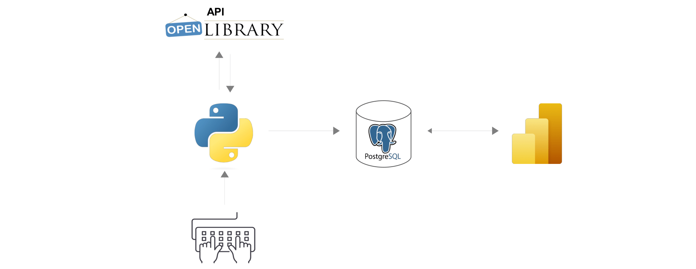
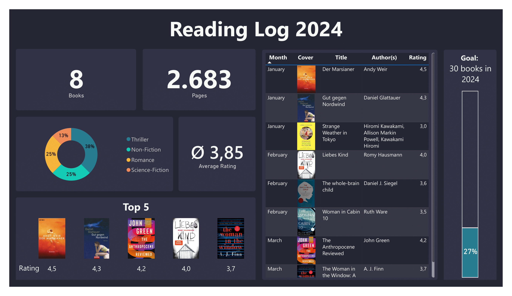

# Reading Tracker

## Short version

I developed a reading tracker to visualize my personal "reading log 2024". Using the ISBN, a Python script extracts further information from the Open Library API like the title, author and the cover for each book. This data is then imported into a PostgreSQL database, where a trigger initiates the normalization. A Power BI dashboard accesses the database and displays information such as total books read, top-rated books and genre distribution.

## Long version
#### Python ([Jupyter Notebook](Python_Reading_Tracker.ipynb))
Using the ISBN, I extract additional information from the [Open Library API](https://openlibrary.org/developers/api), including the book's title, author(s), number of pages, and cover URL. I also enter my personal rating, finishing date, and a simplified genre (the genres provided by the API are far too detailed and inconsistent). The script makes sure all the information is extracted and prompts for manual input if necessary. It then exports the data to a PostgreSQL database.

#### PostgreSQL ([Setup](SQL_Reading_Tracker_Setup.sql), [Import](SQL_Reading_Tracker_Import.sql))
Information about a new book is initially stored in a staging table, and then normalized into separate book and author tables to satisfy the third normal form. A trigger executes the normalization code whenever a new row is added to the staging table. It's possible to add the same book multiple times, as long as the finishing date is different, to allow for re-reads.

#### Power BI ([PBI file](PBI_Reading_Tracker.pbix))
A Power BI dashboard connects to the book and authors tables via Direct Query. 
The dashboard provides visualizations for:
- Total number of books and pages read and my average rating
- Details of all finished books ordered by month of finishing date including title, author(s), cover and rating
- Top 5 rated books
- Distribution of genres
- Progress bar against a self-imposed goal
  
A page-wide filters make it easy to duplicate the dashboard for next year's reading tracker.

This is what the final dashboard looks like:

